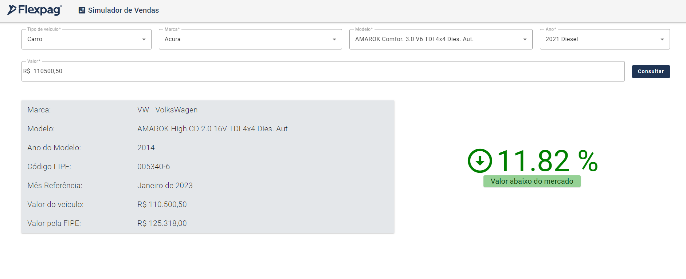

# Desafio Flexpag - Front end

Front end desenvolvido em Angular 15.

Para habilitar dados mockados, setar a chave [_useMockData_](https://github.com/gabrielmmats/flexpag-desafio-frontend-gabriel-mendes/blob/main/src/app/core/services/config.json) para _true_.

Para rodar o projeto em modo dev, execute `ng serve` e vá para `http://localhost:4200/`.

Preview da aplicação:

